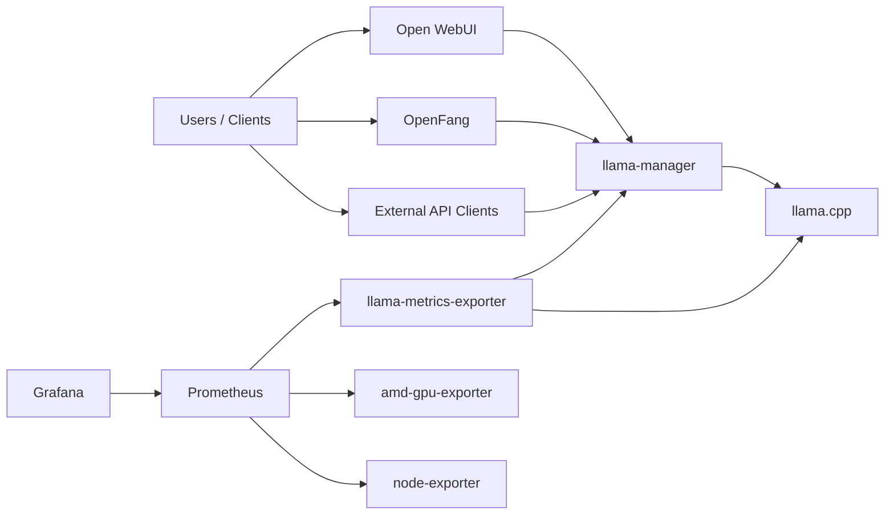

<div align="center">

# 🐆 Panther Minor

> A self-hosted AI workstation stack for AMD hardware with local LLM inference, agent orchestration, monitoring, and GPU-aware power saving.


Panther Minor gives you a reproducible, self-hosted AI cluster tuned for **AMD Ryzen + RDNA 4** systems. It combines
**llama.cpp**, **Open WebUI**, **OpenFang**, **Prometheus**, and **Grafana** into a secure setup with **Tailscale
access**, **hardened SSH**, and **scale-to-zero GPU idle behavior**.

</div>

---

## ✨ Why Panther Minor?

| Feature                  | What it gives you                                                                       |
| ------------------------ | --------------------------------------------------------------------------------------- |
| **Local inference**      | OpenAI-compatible LLM API powered by [LLaMA.cpp](https://github.com/ggml-org/llama.cpp) |
| **Agent orchestration**  | [OpenFang](https://www.openfang.sh/) for automation and agent workflows                 |
| **Built-in monitoring**  | Prometheus, Grafana, and exporters for host + GPU visibility                            |
| **GPU power saving**     | Automatic idle detection and `llama.cpp` scale-to-zero behavior                         |
| **Secure remote access** | Tailscale, key-only SSH on port `2222`, firewall, and fail2ban                          |
| **Reproducible setup**   | One CLI-driven installation flow for the whole workstation                              |

## 🏗️ Architecture



## 🚀 Quick Start

Clone the repository on the target server and run the setup CLI:

> [!WARNING]
> **Reboot is required** after the script completes to load the new kernel drivers and parameters.
> After reboot, SSH will be available on **port 2222** with **key-based authentication only**.
>
> Reconnect with: `ssh -p 2222 <user>@<server-ip>`

```bash
ssh <user>@<server-ip>
git clone https://github.com/rozsival/panther-minor.git
cd panther-minor
sudo ./bin/cli setup
```

> [!TIP]
> You can discover the server IP after login on the host machine using `ip a`.

---

## 🧰 Prerequisites

### Hardware

| Component   | Recommendation                                        |
| ----------- | ----------------------------------------------------- |
| Motherboard | X870E with 2x PCIe Gen5 x16 slots                     |
| CPU         | AMD Ryzen 9 or newer, **12 cores recommended**        |
| Memory      | **64 GB DDR5 or more**                                |
| GPUs        | **2x AMD Radeon Pro RDNA 4** with **32 GB VRAM each** |
| Storage     | NVMe SSD, **1 TB or more**, Gen4 or newer             |
| PSU         | **1300W or more** with 2x 12VHPWR connectors          |

### BIOS

- Above 4G decoding enabled
- Resize BAR enabled
- iGPU disabled
- PCIe slots set to Gen5 and x8/x8 mode
- `M2_1` slot set to Gen4 for the NVMe SSD

> [!NOTE]
> Gen5 GPU + Gen4 SSD is the sweet spot for maximizing GPU performance while maintaining system stability.

### Software

- 🐧 [Ubuntu Server](https://ubuntu.com/download/server) **25.10 or newer**
- Server installed with a non-root user that has `sudo` privileges
- OpenSSH enabled during install (fetching allowed keys from GitHub is supported)
- A [Tailscale](https://tailscale.com/) account for secure remote access
- A domain you control for required SSL certificate issuance and secure service access

---

## ⚙️ What the setup command configures

`sudo ./bin/cli setup` automatically prepares the server with:

- **Init** — server workspace and timezone setup
- **Essential packages** — `build-essential`, `jq`, `nvtop`, `htop`, and more with auto updates
- **Homebrew** — installs Homebrew, `llmfit`, `huggingface-cli`, and `yq` for the current user
- **Docker** — Docker Engine and Docker Compose
- **Tailscale** — Tailscale agent installation
- **SSH** — hardened `/etc/ssh/sshd_config` with port `2222`, key-only auth, and restricted users
- **UFW** — firewall rules for ports `2222`, `80`, and `443`
- **fail2ban** — brute-force protection
- **AMD GPU & ROCm** — latest kernel drivers and ROCm
- **Kernel parameters** — GRUB config with `amdgpu.mes=1 iommu=pt`
- **Git** — default name, email, and rebase pull strategy
- **Shell** — a modern shell prompt for the current user
- **Environment** — creates `.env` from `.env.example` and syncs `VIDEO_GID` / `RENDER_GID`

> [!TIP]
> You can re-run individual setup steps. For example, to apply SSH hardening again:
>
> ```bash
> sudo ./bin/cli setup ssh
> ```

---

## 🔐 Remote access with Tailscale

After the initial setup and reboot, authenticate the server to your
[Tailscale network](https://login.tailscale.com/admin/):

```bash
sudo tailscale up
```

Follow the browser link to complete authentication. Once connected, access the server via its Tailscale IP or hostname:

```bash
ssh -p 2222 <user>@<server-name>
```

> [!TIP]
> It is usually best to
> [disable key expiry](https://login.tailscale.com/admin/machines)
> for the server in Tailscale to avoid losing access.

---

## 🔒 SSL setup

SSL is part of Panther Minor's secure design. Complete these steps to issue and maintain certificates for your domain:

1. Enable HTTPS in Tailscale [DNS settings](https://login.tailscale.com/admin/dns).
2. Add an `A` record in your DNS provider pointing to the server's
   [Tailscale IP address](https://login.tailscale.com/admin/machines).
3. Generate the certificate on the server:

> [!IMPORTANT]
> The script prints the required ACME DNS `CNAME` record value. You must add that record at your DNS provider before
> continuing, otherwise certificate issuance will fail.

```bash
./bin/cli proxy certbot --domain [<subdomain>.]<domain> --challenge-record _acme-challenge[.<subdomain>]
```

4. Enable automatic renewal:

```bash
./bin/cli proxy setup-cron
```

---

## 🧠 LLaMA.cpp cluster

Panther Minor runs local LLMs across both GPUs with an OpenAI-compatible API, a monitoring stack, and
[OpenFang](https://www.openfang.sh/) for agent orchestration.

### Configuration

See `.env` for configurable parameters. Defaults are provided for all non-sensitive values.

#### Hugging Face

A [Hugging Face token](https://huggingface.co/settings/tokens) is not required, but it is recommended to avoid rate
limits when downloading models.

#### OpenFang

It is strongly recommended to build and use your own private image with your custom agents and dependencies. This keeps
the agent environment under your control while preserving the infrastructure-as-code workflow.

> [!TIP]
> Follow the
> [Docker Credential Helper Setup for Ubuntu Server](https://gist.github.com/rozsival/7d82711ca08d5159633db241d698810d)
> to enable secure authentication with private registries from the server.

The default config is mounted at `${OPENFANG_HOME}/config.toml.default`. Your image can use it as a base for
connecting to cluster services and layering custom agent configuration on top.

You can also define custom variables in `./openfang/.env`. They are injected into the OpenFang container at runtime so
you can align the service with your image build and orchestration requirements.

### Model management

See [Models](./models/README.md) for available LLMs and their usage.

### Start the cluster

```bash
./bin/cli cluster start
```

### Rebuild only

```bash
./bin/cli cluster build
# or without cache (for example after config changes):
./bin/cli cluster build --no-cache
```

### Services

| Service                  | Role                                                                          |
| ------------------------ | ----------------------------------------------------------------------------- |
| `llama-cpp`              | OpenAI-compatible LLM inference with RDNA 4 and ROCm 7 support                |
| `llama-manager`          | Activity-aware reverse proxy that tracks inference activity for GPU idle mode |
| `open-webui`             | Chat interface for interacting with LLMs                                      |
| `openfang`               | Agent orchestration platform                                                  |
| `grafana`                | Monitoring dashboard with pre-configured GPU and host metrics                 |
| `prometheus`             | Time-series database for scraping and storing metrics                         |
| `amd-gpu-exporter`       | AMD GPU metrics exporter                                                      |
| `node-exporter`          | Host metrics exporter for CPU, RAM, disk, network, and temperature            |
| `llama-metrics-exporter` | Prometheus exporter for `llama.cpp` metrics                                   |

> [!IMPORTANT]
> Services are **not** accessible from the public internet. See [PORTS.md](PORTS.md) for network details and access
> methods.

### Extending the cluster

You can extend the cluster with custom services or configuration overrides by creating
`docker-compose.override.yml` in the project root. Docker Compose picks it up automatically and merges it with the base
configuration.

Alternatively, you can set `COMPOSE_FILE` in `.env` to point to your custom
[compose file(s)](https://docs.docker.com/compose/how-tos/environment-variables/envvars/#compose_file).

> [!IMPORTANT]
> Always include the base `docker-compose.yml`.

---

## 🔋 GPU idle / power saving

All LLM traffic from Open WebUI, OpenFang, and external clients flows through `llama-manager`, which sits in front of
`llama-cpp` as an activity-aware reverse proxy.

**How it works**

1. `llama-manager` records every model list, inference, and embedding request as activity.
2. When no request has been received within `LLAMA_CPP_SLEEP_IDLE_SECONDS`, `llama.cpp` unloads models from VRAM and
   the GPUs enter a low-power state.
3. `llama-metrics-exporter` checks `llama-manager /status` before each Prometheus scrape. During idle, it serves the
   last active counter values instead of querying `llama.cpp`, so Grafana dashboards keep historical continuity without
   `"No data"` gaps.

A dedicated `llama_metrics_exporter_idle` gauge flips to `1` during idle periods.

Set `LLAMA_CPP_SLEEP_IDLE_SECONDS=0` in `.env` to disable idle mode entirely.

> [!NOTE]
> `llama-manager` uses the Docker socket to stop the `llama-cpp` container when idle and restart it on demand
> (scale-to-zero). This releases VRAM and the GPU compute context fully. On the next inference request, the container
> is started automatically and requests are queued until `llama.cpp` reports healthy.

---

## 🛑 Stop the cluster

```bash
./bin/cli cluster stop
```

## 📚 More documentation

- [Panther Minor CLI](./bin/README.md) — full command reference for managing the cluster
- [Models](./models/README.md) — model presets and usage
- [PORTS.md](./PORTS.md) — ports, routing, and service access details
