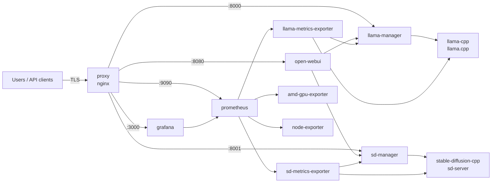

# 🏗️ Architecture

> Panther Minor is one Docker Compose project on one host. An nginx `proxy` terminates TLS and is the only service
> that publishes ports; behind it, activity-aware managers front `llama.cpp` and `stable-diffusion.cpp`, Open WebUI
> provides the chat UI, and Prometheus + Grafana watch the host and both GPUs.

**Related:** [Networking & security](networking.md) · [Operations](operations.md) ·
[GPU power & VRAM](gpu-management.md) · [Monitoring](monitoring.md)

---

## 🗺️ Service map

> [!IMPORTANT]
> Panther Minor is a **single-tenant** system for one trusted user and workload. Open WebUI runs with
> `WEBUI_AUTH=false` and Grafana grants anonymous `Admin`; access control is the network boundary described in
> [Networking & security](networking.md). It is not suitable for multi-user or untrusted environments.

## 🧩 Services

All services share the `ai` bridge network. Only `proxy` publishes ports; every other service uses `expose:`.

| Service                  | Internal port | Role                                                                                     |
| ------------------------ | ------------: | ---------------------------------------------------------------------------------------- |
| `proxy`                  |             — | nginx TLS termination; publishes `3000`, `4200`, `8000`, `8001`, `8080`, `9090`          |
| `llama-cpp`              |        `8000` | OpenAI-compatible LLM inference (router mode) with RDNA 4 and ROCm 10 support            |
| `llama-manager`          |        `8000` | Activity-aware reverse proxy with idle unload and large-model switch handling            |
| `stable-diffusion-cpp`   |        `8000` | OpenAI-compatible image generation (`sd-server`) with RDNA 4 and ROCm 10 support         |
| `sd-manager`             |        `8000` | Activity-aware reverse proxy in front of `sd-server`                                     |
| `open-webui`             |        `8080` | Chat and image-generation interface                                                      |
| `grafana`                |        `3000` | Dashboards with pre-provisioned GPU, host, `llama.cpp` and `stable-diffusion.cpp` panels |
| `prometheus`             |        `9090` | Time-series database scraping and storing metrics (30-day retention)                     |
| `amd-gpu-exporter`       |        `5000` | AMD GPU metrics exporter (`rocm/device-metrics-exporter`)                                |
| `node-exporter`          |        `9100` | Host metrics exporter for CPU, RAM, disk, network, and temperature                       |
| `llama-metrics-exporter` |        `9090` | Idle-aware Prometheus exporter for `llama.cpp` metrics                                   |
| `sd-metrics-exporter`    |        `9090` | Prometheus exporter for `stable-diffusion.cpp` activity                                  |

`llama-cpp` and `stable-diffusion-cpp` are built locally from pinned upstream refs (`LLAMA_CPP_REPO`/`LLAMA_CPP_REF`,
`SD_CPP_REPO`/`SD_CPP_REF` in `.env`) for `ROCM_ARCH=gfx1201`. The managers and exporters are plain Node.js scripts
mounted read-only into `node:24-trixie-slim` containers.

## 🔀 Request flow

| Request                       | Path                                                                                                    |
| ----------------------------- | ------------------------------------------------------------------------------------------------------- |
| Chat / completion / embedding | client → `proxy :8000` → `llama-manager` → `llama-cpp`                                                  |
| Image generation              | client → `proxy :8001` → `sd-manager` → `stable-diffusion-cpp`                                          |
| Open WebUI chat               | browser → `proxy :8080` → `open-webui` → `llama-manager` (chat, RAG embeddings) / `sd-manager` (images) |
| Metrics scrape                | `prometheus` → exporters → managers (`/status`) and upstream servers                                    |

Both managers record every proxied request as activity and expose `GET /health` and `GET /status`. `llama-manager`
additionally unloads idle models and serializes large-model switches — see [GPU power & VRAM](gpu-management.md).

## 📁 Repository layout

| Path                    | Contents                                                                                          |
| ----------------------- | ------------------------------------------------------------------------------------------------- |
| `bin/panther-minor`     | Generated CLI — never edit by hand ([CLI reference](cli.md))                                      |
| `cli/`                  | Authored Bashly CLI sources                                                                       |
| `llama-cpp/`            | `Dockerfile`, `entrypoint.sh`, `preset.ini`, `manager.js`, `metrics-exporter.js`, `models.js`     |
| `stable-diffusion-cpp/` | `Dockerfile`, `entrypoint.sh`, `manager.js`, `metrics-exporter.js`, `models.js`                   |
| `models/`               | Model catalogs (`*.config.json`), schemas, `bench.log`, and the `.huggingface` weight cache       |
| `monitoring/`           | `prometheus.yml`, Grafana provisioning and dashboards                                             |
| `proxy/`                | `nginx.conf`, TLS material in `proxy/ssl/`                                                        |
| `harnesses/`            | Coding-agent provider presets ([Coding harnesses](harnesses.md))                                  |
| `terminfo/`             | `xterm-ghostty` source that `setup shell` compiles into `/etc/terminfo`                           |
| `docs/`                 | This documentation                                                                                |
| `.agents/skills/`       | Agent skills for recurring maintenance tasks ([Development](development.md#-agent-assets))        |
| `extra/`                | Untracked space for your own override assets ([Operations](operations.md#-extending-the-cluster)) |

---

## ❓ FAQ

### Why is there a manager in front of each inference server?

`llama.cpp` and `sd-server` do not know when the workstation is idle or which large model should yield VRAM to
another. The managers observe all traffic, so they can unload idle models, serialize large-model switches and tell
the exporters whether a scrape would wake anything up.

### Can I swap in another inference backend?

No. The stack is built around custom ROCm builds of `llama.cpp` (LLMs) and `stable-diffusion.cpp` (images) for
`gfx1201`; the managers, exporters, presets and CLI all assume those servers.

### Is there any authentication?

Not at the application layer. Open WebUI has auth disabled and Grafana is anonymous admin, by design for a
single trusted user. Exposure is limited by binding published ports to loopback and the Tailscale address only.

### Where do I add my own services?

In `docker-compose.override.yml` or a custom `COMPOSE_FILE` — see
[Extending the cluster](operations.md#-extending-the-cluster).
