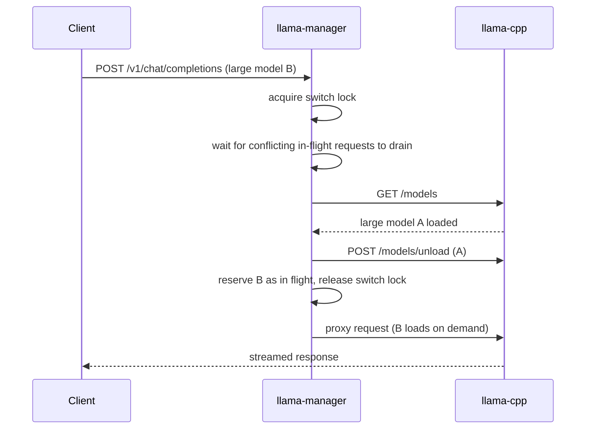

# 🔋 GPU Power & VRAM Management

> All LLM traffic flows through `llama-manager`, an activity-aware reverse proxy in front of `llama-cpp`. It unloads
> idle models to save power and VRAM, and serializes switches between large models so they never collide in VRAM.
> Image generation frees its own VRAM between images.

**Related:** [LLM serving](llm.md) · [Image generation](image-generation.md) · [Monitoring](monitoring.md) ·
[Architecture](architecture.md)

---

## 💤 Idle VRAM unloading

When the cluster is idle, `llama-manager` unloads every model from `llama.cpp` to free VRAM and reduce power draw:

1. `llama-manager` records every model list, inference, and embedding request as activity.
2. When no request arrives within `LLAMA_CPP_SLEEP_IDLE_SECONDS`, it checks `/models` and calls `/models/unload` for
   each still-loaded model, so `llama.cpp` releases VRAM without restarting the container. A failed unload is retried
   after `IDLE_UNLOAD_RETRY_SECONDS`.
3. `llama-metrics-exporter` checks `llama-manager /status` before each Prometheus scrape. During idle it serves the
   last active counter values plus a fresh `/models` snapshot instead of querying `/metrics`, but still performs one
   catch-up scrape after unseen activity so short requests are not missed between scrape intervals.

The `llama_metrics_exporter_idle` gauge reads `1` during idle periods.

> [!TIP]
> Set `LLAMA_CPP_SLEEP_IDLE_SECONDS=0` in `.env` to disable idle mode entirely.

## 🔀 Large-model switch handling

`llama-manager` prevents avoidable OOM spikes when you switch between bigger models while keeping a lightweight second
model resident (for embeddings or quick tasks):

1. A static list of large model IDs (`largeModelIds`) lives in `llama-cpp/models.js`.
2. Before proxying an inference request for one of those models, the manager reads the request body, checks
   `/models`, and unloads any other loaded large model first.
3. Large-model switches are serialized, and a loaded large model is never unloaded while one of its proxied inference
   requests is still in flight.

This keeps the small helper model untouched while making large-model handovers deterministic.

Embedding models are deliberately excluded from `/models` bookkeeping, so the RAG model stays resident throughout and
is never unloaded to make room. Models that would otherwise crowd it out free VRAM in `llama-cpp/preset.ini` instead:
`Qwen3.8-Flash-Next` moves blocks 0-27's routed experts to system RAM with `n-cpu-moe = 28`. Its 26.82 GiB n-gram
table is read host-side and never enters VRAM at all.

## 🎨 Image generation VRAM

`sd-server` offloads its weights to RAM between generations (`--offload-to-cpu`), so it only holds VRAM while actually
producing an image — idle image-generation VRAM frees itself. Short on VRAM, it streams weights in segments and tiles
the VAE decode, so either image model shares the GPUs with `Qwen3.8-27B`; larger LLMs leave too little.

For those, or heavy image sessions, `models t2i load --exclusive` dedicates a GPU to image generation and
`models t2i unload` gives it back to the LLMs — see [Recommended workflows](image-generation.md#-recommended-workflows)
and [GPU assignment](image-generation.md#gpu-assignment). `sd-manager` records image activity and exposes a
`sd_metrics_exporter_idle` gauge for Grafana.

## 🎚️ Tunables

| Setting                        | Where                 | Default | Effect                                                                                                             |
| ------------------------------ | --------------------- | ------: | ------------------------------------------------------------------------------------------------------------------ |
| `LLAMA_CPP_SLEEP_IDLE_SECONDS` | `.env`                |   `900` | Idle time before LLM unload; `0` disables                                                                          |
| `SD_CPP_SLEEP_IDLE_SECONDS`    | `.env`                |   `900` | Idle time before `sd-manager` reports image generation idle                                                        |
| `IDLE_UNLOAD_RETRY_SECONDS`    | `docker-compose.yml`  |    `15` | Retry delay after a failed idle unload                                                                             |
| `PROXY_TIMEOUT_SECONDS`        | `docker-compose.yml`  |   `900` | Inactivity ceiling for proxied streams (cold loads stream nothing for minutes); matches nginx `proxy_read_timeout` |
| `UPSTREAM_TIMEOUT_SECONDS`     | `docker-compose.yml`  |     `4` | Bound for the manager's own `/models` and `/models/unload` calls                                                   |
| `largeModelIds`                | `llama-cpp/models.js` |       — | Models subject to large-model arbitration                                                                          |

## 🩺 Manager endpoints

| Endpoint      | Service                       | Returns                                               |
| ------------- | ----------------------------- | ----------------------------------------------------- |
| `GET /health` | `llama-manager`, `sd-manager` | `ok` — used by Compose health checks                  |
| `GET /status` | `llama-manager`, `sd-manager` | JSON activity state consumed by the metrics exporters |

Both are internal to the `ai` network; check them with `docker exec`, or watch the idle gauges in
[Monitoring](monitoring.md).

---

## ❓ FAQ

### My first request after a break is slow. Why?

The model was unloaded after `LLAMA_CPP_SLEEP_IDLE_SECONDS` of inactivity and is loading again. Raise the timeout or
set it to `0` to keep models resident.

### Can a model be unloaded in the middle of my request?

No. A large model is never unloaded while one of its proxied inference requests is in flight, and idle unloading only
starts after the idle window with no requests.

### How do I mark a new model as "large"?

Add its ID to `largeModelIds` in `llama-cpp/models.js` (the `add-model` skill does this for models ≥ 27B).

### Why is the embedding model never evicted for a large model?

Embedding models are excluded from the manager's `/models` bookkeeping, and the largest model frees VRAM itself via
`n-cpu-moe`, so RAG keeps working while large models switch.

### Why do Grafana's `llama.cpp` panels go flat when idle?

By design: the exporter stops querying `/metrics` while idle so scrapes never keep models awake. See
[Monitoring](monitoring.md#-idle-aware-scraping).
