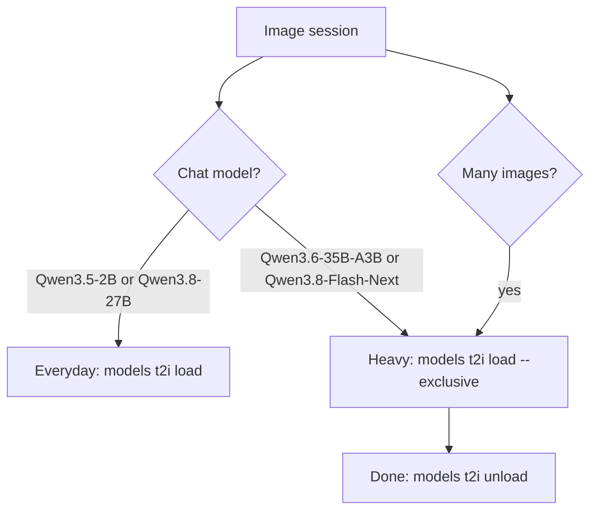

# 🎨 Image Generation

> Local text-to-image generation runs on [stable-diffusion.cpp](https://github.com/leejet/stable-diffusion.cpp)'s
> `sd-server`, exposed as an OpenAI-compatible image API (`POST /v1/images/generations`) on port `8001` through
> `sd-manager`. Exactly one image model is resident at a time; the CLI switches models and decides whether image
> generation shares the GPUs with the LLMs or gets one to itself.

**Related:** [Models](models.md#-text-to-image-models) · [GPU power & VRAM](gpu-management.md) ·
[LLM serving](llm.md) · [Operations](operations.md)

---

## ⚙️ Configuration

Models are defined in `models/t2i.config.json` (schema in `models/t2i.schema.json`); the catalog is listed in
[Models](models.md#-text-to-image-models).

| Field        | Meaning                                                                                                                               |
| ------------ | ------------------------------------------------------------------------------------------------------------------------------------- |
| `components` | Weight files the model needs: diffusion, optional unconditional diffusion, LLM text encoder, VAE — each model lists only what it uses |
| `args`       | _(optional)_ Extra `sd-server` flags for per-model sampling defaults (e.g. `--cfg-scale` and `--steps` for Qwen-Image)                |

Ideogram 4 has a separate unconditional diffusion model; Qwen-Image doesn't. Both share the same Qwen3-VL-8B encoder
file, so it is downloaded once and `remove` keeps it while the other model needs it. `load` writes `args` to
`SD_CPP_MODEL_ARGS` in `.env`, so tuning switches with the model.

> [!IMPORTANT]
> Ideogram 4 requires **JSON prompts** and will most likely fail on a plain text prompt — see its
> [prompting guide](https://github.com/ideogram-oss/ideogram4/blob/main/docs/prompting.md#prompting-guide). The
> `ideogram4-prompt` agent skill (`.agents/skills/ideogram4-prompt/SKILL.md`) generates valid JSON prompts from
> natural language, but needs a sufficiently capable chat model to drive it.

## 🎛️ Management

```bash
./bin/panther-minor models t2i list|download|remove <model>   # Components (-f forces re-download)
./bin/panther-minor models t2i load [-e] <model>              # Serve it (-e dedicates a GPU)
./bin/panther-minor models t2i unload                         # Stop sd-server, return dedicated GPUs to the LLMs
```

`sd-server` loads exactly **one** model per process, so `load` rewrites the active-model variables in `.env`
(`SD_CPP_MODEL`, `SD_CPP_DIFFUSION_MODEL`, `SD_CPP_UNCOND_DIFFUSION_MODEL`, `SD_CPP_LLM`, `SD_CPP_VAE`,
`SD_CPP_MODEL_ARGS`) and recreates the container — switching never leaves two models in VRAM.

### GPU assignment

| Mode             | Command                      | LLM GPUs (`ROCM_VISIBLE_DEVICES`) | `sd-server` GPU             |
| ---------------- | ---------------------------- | --------------------------------- | --------------------------- |
| Shared (default) | `models t2i load <model>`    | unchanged                         | `SD_VISIBLE_DEVICES`        |
| Exclusive        | `models t2i load -e <model>` | `LLAMA_CPP_GPUS_SHARED`           | `SD_VISIBLE_DEVICES`, alone |
| Back to LLMs     | `models t2i unload`          | `LLAMA_CPP_GPUS_STANDALONE`       | stopped                     |

By default `load` only swaps the model, leaving GPU assignment untouched so the LLMs keep all GPUs — the right mode for
the [everyday workflow](#everyday-chat-with-occasional-images-no-gpu-switching). For
[heavy image sessions](#heavy-image-sessions-dedicate-a-gpu), `load --exclusive` shrinks the LLMs from
`LLAMA_CPP_GPUS_STANDALONE` to `LLAMA_CPP_GPUS_SHARED`, freeing `SD_VISIBLE_DEVICES` for `sd-server` alone; `unload`
restores it. Both recreate `llama-cpp`, so resident LLMs reload lazily — switch modes per session, not per image.

All four variables live in `.env` (documented in `.env.example`) and default to a two-GPU box; edit them to match your
topology.

## 🖼️ Open WebUI integration

Open WebUI talks to `sd-manager` (`IMAGES_OPENAI_API_BASE_URL`) at `IMAGE_SIZE=1024x1024`. Switching models is
entirely a CLI operation: `sd-server` ignores the model id in the request, so **Open WebUI needs no changes**.

- Leave its image model field at `default`.
- Never touch the admin image settings.
- Treat `IMAGE_GENERATION_MODEL` as a label — the Images panel lists only the loaded model, all `sd-server` reports.

## 🧭 Recommended workflows

LLMs and image generation share the same GPUs, so running heavyweight models of both kinds at once contends for VRAM.
`sd-server` always runs on `SD_VISIBLE_DEVICES` (GPU 1), which also hosts the pinned `Qwen3-Embedding-0.6B` and
`Qwen3.5-2B` (~5.8 GiB together). Pick the workflow that matches your session.



### Image model footprint

Measured on GPU 1 at 1024×1024, weights offloaded to RAM between generations:

| Image model               | Weights (RAM) | Peak VRAM, GPU to itself | Generation |
| ------------------------- | ------------: | -----------------------: | ---------: |
| `Qwen-Image-2.1` (Q8_0)   |      12.1 GiB |                  8.6 GiB |       77 s |
| `Ideogram-4` (Q4_0)       |      15.0 GiB |                 10.7 GiB |       88 s |
| `Qwen-Image-2512` (Q8_0)¹ |      25.0 GiB |                 21.3 GiB |      196 s |

¹ Replaced by `Qwen-Image-2.1`; kept for comparison (40 steps against 2.1's 20, weights summed from its files). The
other weights are `sd-server`'s own totals.

When the image GPU has less free VRAM than the peak, `sd-server` degrades instead of failing: it streams the diffusion
weights in segments and tiles the VAE decode. At ~2 GiB free it cannot fit a segment and returns HTTP 500 at once; the
LLMs keep serving. Measured with the pinned small models resident:

| Large chat model     | GPU 1 used before image | `Qwen-Image-2.1`           | `Ideogram-4`                |
| -------------------- | ----------------------: | -------------------------- | --------------------------- |
| `Qwen3.8-27B`        |                25.3 GiB | ✅ 85 s (segmented, tiled) | ✅ 111 s (segmented, tiled) |
| `Qwen3.6-35B-A3B`    |                30.2 GiB | ❌ HTTP 500                | ❌ HTTP 500                 |
| `Qwen3.8-Flash-Next` |                31.8 GiB | ❌ HTTP 500                | ❌ (less room than 35B-A3B) |

Load the chat model **before** generating, as the everyday flow does anyway: a large LLM loaded while `sd-server`
holds its peak finds that VRAM taken.

### Everyday: chat with occasional images (no GPU switching)

Load an image model once (`./bin/panther-minor models t2i load <model>`) and leave GPU assignment alone — no
reassignment, no restarts, no cleanup, and `stable-diffusion.cpp` holds VRAM only while producing an image. The chat
model's only role is **authoring the prompt**, so match it to the loaded image model:

| Loaded image model | Prompting                                  | Recommended chat model        | Why                                                                                     |
| ------------------ | ------------------------------------------ | ----------------------------- | --------------------------------------------------------------------------------------- |
| `Qwen-Image-2.1`   | Plain text                                 | `Qwen3.5-2B` to `Qwen3.8-27B` | Any co-resident model can write a plain prompt; a larger one writes richer descriptions |
| `Ideogram-4`       | Structured JSON (`ideogram4-prompt` skill) | `Qwen3.8-27B`                 | Small models can't drive the JSON-prompt skill; larger ones leave the image GPU no room |

### Heavy image sessions: dedicate a GPU

For many images, or a pairing the shared GPUs cannot fit — **`Qwen3.6-35B-A3B` or `Qwen3.8-Flash-Next` next to any
image model** — give image generation a GPU of its own. Next to `Qwen3.8-27B` it also avoids segmented streaming and
tiling, which cost +10% (`Qwen-Image-2.1`) to +26% (`Ideogram-4`) per image. See [GPU assignment](#gpu-assignment) for
the mechanics.

```bash
./bin/panther-minor models t2i load --exclusive <model>   # LLMs shrink onto their own GPU(s), sd-server gets a dedicated one
./bin/panther-minor models t2i unload                     # Done: sd-server stops, all GPUs return to the LLMs
```

---

## ❓ FAQ

### Image generation returns HTTP 500. Why?

The image GPU has under ~2 GiB free, usually because a large chat model (`Qwen3.6-35B-A3B`, `Qwen3.8-Flash-Next`)
fills it. Use `models t2i load --exclusive <model>`, or switch to `Qwen3.8-27B` or smaller.

### Do I need to change Open WebUI after switching image models?

No. `sd-server` ignores the requested model id; leave the image model field at `default`.

### Why can only one image model be loaded?

`sd-server` loads exactly one model per process. `load` swaps it by recreating the container.

### Ideogram 4 produces garbage or errors on my prompt. Why?

It requires structured JSON prompts. Use the `ideogram4-prompt` skill with a capable chat model such as
`Qwen3.8-27B`, or switch to `Qwen-Image-2.1`, which accepts plain text.

### Does an idle image model hold VRAM?

No. `sd-server` offloads weights to RAM between generations and only holds VRAM while producing an image — see
[GPU power & VRAM](gpu-management.md#-image-generation-vram).

### Why did my chat model reload after `--exclusive` or `unload`?

Both recreate `llama-cpp` with a different GPU set, so resident LLMs reload lazily on the next request. Switch modes
per session, not per image.
